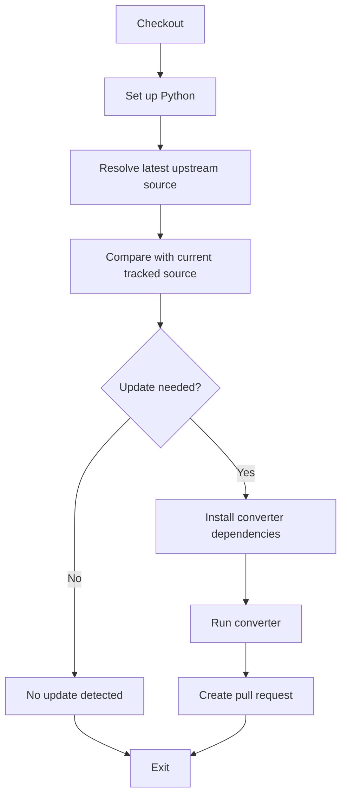

# ResPro Database Conversion Pattern

This repository is intended as a general home for ResPro-compatible, auto-updated antiviral resistance databases.

## Global metadata manifest

To simplify unauthenticated clients, this repository publishes a single discovery file at `databases/manifest.json`.
The manifest is generated from all `databases/*/output/metadata.json` files and includes:

- source name
- relative path to `metadata.json`
- relative path to `rules.tsv`
- relative path to `formula-rules.tsv` (empty when not present)
- embedded metadata content

For GitHub-based consumers, fetch it via the raw URL:

`https://raw.githubusercontent.com/jonas-fuchs/respro-db/main/databases/manifest.json`

Then follow `metadata_path` and `rules_path` entries directly for each source.

## Repository purpose

- fetch curated upstream source data (Zenodo, Github, release assets, or similar)
- transform source data into ResPro-compatible TSV artifacts
- track non-migrated source rows with explicit reasons
- auto-update outputs via GitHub Actions and open update PRs only when a new upstream version is detected

## Required structure per conversion

Each source database needs to use its own folder under databases:

```text
databases/manifest.json

databases/<source_name>/
  scripts/
    convert.py
    requirements.txt
  output/
    rules.tsv
    formula-rules.tsv        # only when combination rules are present
    metadata.json
    non-migrated-rules.txt
```

And one workflow per source in .github/workflows:

```text
.github/workflows/<source_name>-autobump.yml
```

## GitHub Workflow Pattern

All autobump workflows follow a consistent logical structure, with identical step names and flow. Implementation details vary based on the source type (Zenodo API, GitHub API, release assets, etc.), but the workflow steps remain standardized:



### Unified Workflow Step Names and Responsibilities

1. **Checkout**: Clone repository code
2. **Set up Python**: Install Python 3.12
3. **Resolve latest upstream source**: Fetch upstream source metadata
   - For Zenodo: Query API for latest record ID and updated timestamp
   - For GitHub: Query GitHub API for latest commit date of the source file
   - Output: `source_url`, `source_commit_date` (or equivalent timestamp), and version identifier (record ID or commit SHA)
4. **Compare with current tracked source**: Check if update is needed
   - Compare upstream timestamp/ID with `maintainer_update` field in current `metadata.json`
   - Output: `should_update` flag (true/false) and `current_source_date`
5. **Install converter dependencies**: Run `pip install -r databases/<source>/scripts/requirements.txt`
6. **Run converter**: Execute conversion script with `--source-url` and `--output-dir` arguments
   - Converter fetches the upstream source timestamp independently (from API or response headers)
   - Converter validates and produces TSV outputs
   - Converter sets `maintainer_update` in metadata.json to the fetched source timestamp
7. **No update detected**: Informational step shown when no update is needed
8. **Create pull request**: Open PR with source metadata in body and output files in `add-paths`

### Pull Request Format

All autobump PRs follow this format:

```yaml
title: "chore: autobump <source_name> outputs"
body: |
  Automated monthly/weekly update for <SOURCE> source data.
  
  - Previous source date: <previous_timestamp>
  - Source timestamp: <latest_timestamp>
  - Source version: <record_id|commit_sha>
  - Source URL: <upstream_url>
  
  This PR was generated by the autobump workflow.
labels:
  - autobump
add-paths:
  - databases/<source>/output/rules.tsv
  - databases/<source>/output/formula-rules.tsv
  - databases/<source>/output/metadata.json
  - databases/<source>/output/non-migrated-rules.txt
```

## Converter Script Pattern

All converter scripts accept these standard arguments and produce consistent console output:

### Required Arguments

- `--source-url`: Upstream data source URL (can be hardcoded or passed from workflow)
- `--output-dir`: Directory where TSV artifacts and metadata.json should be written

### Console Output Format

All converter output must go to `stderr` (not `stdout`). Use an `eprint()` helper for consistent routing:

```python
def eprint(msg: str) -> None:
    print(msg, file=sys.stderr)
```

Converters must follow this standardized output sequence:

```
Source date: <YYYY-MM-DD>                     # as early as possible (before or after Downloading, depending on source)
Downloading <url> …
Parsed <N> source rows                          # optional – omit for non-tabular sources
Written <rules_path> (<N> rows).
Written <formula_path> (<N> rows).              # only when formula rows exist; delete file if empty
Written <metadata_path>.
Written <non_migrated_path> (<N> aggregated entries).
Done.
```

**Rules:**

- **All output to `stderr`** — never write progress messages to `stdout`.
- **`Source date:`** — the date used for `maintainer_update` in metadata.json (fetched from upstream API, `--source-date` argument, or fallback). Print this as early as the date is known — ideally before `Downloading`, but after is acceptable when the date is derived from the downloaded content.
- **`Downloading <url> …`** — emitted when the upstream source fetch begins (use `…` ellipsis, not `...`).
- **`Written` lines** — emit one line per output file, in the order shown. The `(N rows)` / `(N aggregated entries)` count includes only data rows (not the header). Omit the formula-rules line entirely when there are no formula rows (and delete the file if it exists).
- **`Done.`** — final line confirming successful completion.
- **Diagnostic messages** — `WARNING:` and `SKIPPED:` / `DROPPED:` lines are allowed at any point before `Done.` but must also go to `stderr`. These are for per-row conversion notes and validation warnings.
- **Auxiliary fetch messages** — converters that download additional resources (e.g., drug maps, gene data) may emit extra `Fetching <url> …` lines between `Downloading` and `Written`.

### Converter Responsibilities

1. Download/fetch source data from `--source-url`
2. Parse and validate input schema
3. Transform to atomic rules (one mutation per row) and optional formula rules (grouped combinations)
4. Deduplicate by `(gene, reference_id, position, mutation, antiviral, publication)` tuple
5. Sort deterministically for reproducible output
6. Generate `rules.tsv` with required columns: `gene`, `reference_identifier`, `position`, `reference`, `mutation`, `antiviral`
7. Generate optional `formula-rules.tsv` (only if `group_id` + formula cases exist)
8. Generate `metadata.json` with fixed schema (see `formatting_instructions/README`)
   - Fetch source timestamp from upstream API; fall back to today's date only if API is unavailable
   - Compute `tsv_checksum` as `sha256:<hex>` of rules.tsv content
9. Generate `non-migrated-rules.txt` with audit trail of rows that couldn't be converted
10. Validate all required columns and fail fast on schema mismatches
11. Print standardized progress messages to stderr

### Example: Adding a New Database

To add a new upstream database:

1. Create `databases/<source_name>/scripts/convert.py`
   - Accept `--source-url` and `--output-dir` arguments
   - Fetch the source timestamp from the upstream API and set it as `maintainer_update`
   - Follow the converter output format and responsibilities above
2. Create `databases/<source_name>/scripts/requirements.txt` with dependencies
3. Create `.github/workflows/<source_name>-autobump.yml`
   - Use the workflow step names and structure shown above
   - Adapt the "Resolve latest upstream source" step for your source type
   - All other steps remain identical
4. Add your source metadata to the converter's hardcoded config (maintainers, publication PMID, license, etc.)

## You would like support for your database?

Either open a PR here and add the required files or open an issue which database you would like to have supported. We will do our best to make it possible. Importantly, we will need some kind of API to that database to be able to check for updates in regular intervals and autoupdate the respective files in the repo.
